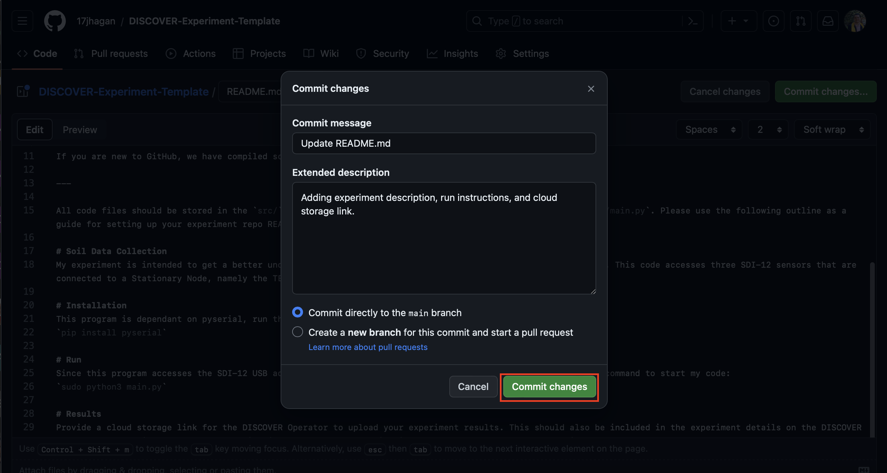

# Usage Guide for the DISCOVER Experiment Template
This document is meant to help guide new GitHub users to use the DISCOVER Experiment Template. We will walk through how to prepare your experiment code so that the experiment submission process will be as smooth as possible!

## Fork this repository

On the home page of this repository, there is an option to 'Fork' this repo. This will create a local copy for your personal user.

You should be prompted with your forked version of the repository. Look out for the following:

Once it's complete, collect the experiment code that you would like to submit.

## Populating the Template

Next, we need to rename our primary execution file (the file that starts our experiment) to `main.py`, then upload our source code into the `src/` folder.

Primary execution file: sdi-12-data-collector.py

Renamed to main.py:

Now, back on GitHub, we need to enter the `src/` folder and upload our files. Follow these steps:

Open the `src/` folder:

Click 'Upload Files':

Either drag and drop your files, or select them manually:

Once you've selected the files, add a brief description to your commit and click 'Commit changes':

Now, your `src/` folder should contain all of your experiment code!

## Description and Build Instructions for My Experiment

Next, we need to describe what our experiment is intended to do and how to build/run my program.

Click 'Edit' on the README.md file:

Scroll down to around line 14, and refer to the following screenshot to see what fields need to be updated:

Once you've added your edits, it should look something like this:

After you are satisfied with your changes, we now need to decide where we want our experiment data to be stored. In this example, I will set up an empty Google Drive folder with the access permissions set for anyone who has the link:

Open Google Drive and Create a new folder (I named mine 'Soil Data Collector Experiment Results'):

Next, enter the new folder you just created and navigate to the share options:

Update the access permissions from 'Restricted' to 'Anyone with the link':

Copy the link and paste it into the README:

Add the link to the README in the Results section:

At this point, we are ready to save our README file, scroll to the top of the page and click 'Commit changes...':

## Move on to DISCOVER Portal

Now that you've detailed your experiment, added run instructions, and have your cloud storage link ready, you are prepared to go to the DISCOVER Portal and submit an experiment!

For assistance on how to submit an experiment, please follow the DISCOVER User Manual.
